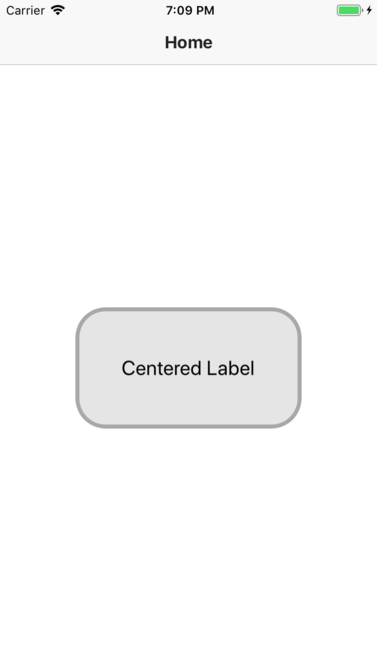
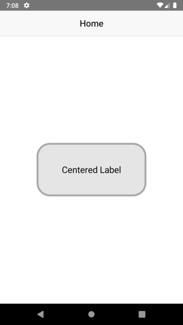

# NativeScript Centered Label

 &nbsp;&nbsp;&nbsp;&nbsp;


This plugin allows you to have Label that are centered both vertically and horizontally

## Demo apps
 
### NativeScript-Core (XML)
Check out the [demo](/demo) folder. This is how to clone and run it:

```bash
git clone https://github.com/mhtghn/nativescript-centered-label
cd nativescript-centered-label/src
npm run demo.ios # or demo.android
```

### NativeScript-Angular
Check out the [demo-angular](/demo-angular) folder. This is how to clone and run it:

```bash
git clone https://github.com/mhtghn/nativescript-centered-label
cd nativescript-centered-label/src
npm run demo-angular.ios # or demo-angular.android
```

## Installation


```javascript
tns plugin add nativescript-centered-label
```

## Usage 

### NativeScript-Core (XML)
```xml
<Page class="page"
    navigatingTo="onNavigatingTo"
    xmlns="http://schemas.nativescript.org/tns.xsd" xmlns:ui="nativescript-centered-label">

    <ActionBar class="action-bar">
        <Label class="action-bar-title" text="Home"></Label>
    </ActionBar>

    <GridLayout>
        <!-- Add your page content here -->
        <ui:CenteredLabel text="Centered Label" class="c-label"></ui:CenteredLabel>
    </GridLayout>
</Page>
```

### NativeScript Angular

#### TypeScript

```typescript
...
import {CenteredLabelModule} from "nativescript-centered-label";

@NgModule({
    imports: [
        ...
        CenteredLabelModule
    ],
    ...
})
export class HomeModule { }
```

#### HTML

```HTML
<ActionBar class="action-bar">
    <Label class="action-bar-title" text="Home"></Label>
</ActionBar>

<GridLayout class="page">
    <CenteredLabel text="Centered Label" class="c-label" (tap)="testTap()"></CenteredLabel>
</GridLayout>
```

#### CSS
```CSS
.c-label{
    background-color: rgba(0, 0, 0, 0.1);
    border-width: 4;
    border-color: #a8a8a8;
    height: 20%;
    width: 60%;
    border-radius: 30;
    color: black;
    font-size: 20;
}
```
